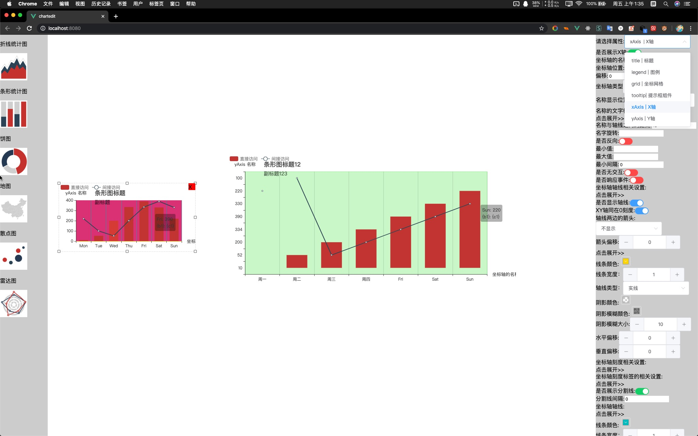

# chartedit

## Project setup

## 不美观，仅供学习参考使用


```
yarn install
```

### Compiles and hot-reloads for development

```
yarn serve
```

### Compiles and minifies for production

```
yarn build
```

### Lints and fixes files

```
yarn lint
```

### Customize configuration

See [Configuration Reference](https://cli.vuejs.org/config/).

# 图表在线可视化编辑工具

## 支持 echart 图表，基于其扩展性可支持任何配置性组件，包括定制化其他组件等，实现可编辑网页

## 只要给出数据样例和映射组件类型，可自动映射到相应组件并刷新视图

## 一键导出代码和配置 后续增加导出.vue 格式文件和配置

## 一键生成 html 静态网页 需要后端 node 支持 

## 更多功能想象中。。。
